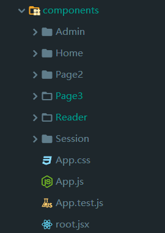

# 玖读epub电子书阅读平台

同济大学2019年春季学期Web课程课程项目

项目网址：<https://mooooon333.github.io/epub-reading-platform


## 项目启动
node version <= 12(node 13 and above is not compatible with node-saas version 4.12.0)
Install dependency: npm install or yarn
Run: npm start or yarn start

## 框架及工具使用

前端：

- 前端框架：react
- 脚手架：create-react-app
- 路由：react-router-dom
- 数据管理：react-redux
- UI组件：ant-design，material-ui
- SVG图片加载：SVGLoader.js
- 动画：react-three-fiber，react-spring
- epub渲染：epub.js
- 笔记抓取：rangy
- 数据持久化：redux-persist

后端：

- 后端框架：flask
- 数据库：mysql
- 后端数据库交互：pymysql

## 文件结构


前端核心源码在scr文件夹里。由于本项目采用react-redux管理数据，redux的三个核心对象action， reducer，store分别存放在actions，reducers，store三个文件夹中。assets文件夹存放css所使用的一些静态资源。components里为界面组件的主要实现部分。



- Admin：后台管理员页面
- Home：首页
- Page2：书城
- Page3：书架
- Session：登录
- Reader：阅读界面


导航条如图，分别与Home,Page2,Page3,Session这四个文件夹对应

## 首页

首页没有功能性的东西，为对网站的简单介绍。


## 登录


登录界面如图。如果想要使用账号密码登录需要先在下方注册。也可以直接点击**以guest身份登录**就无需注册。


登录成功后界面会变为如图。点击登出就可以退出登录。

登录和注册的数据发送与处理由session_action.jsx和session_reducer.js管理。以登录为例简单说明：

表单信息的提交由session_form.jsx里的handleSubmit负责，其调用this.props.processForm函数，它是在session_form_container里与dispatch函数对应起来的。

```js
const mapDispatchToProps = (dispatch) => {
    return {
        processForm: user => dispatch(login(user)),
        ...
        }
}
```

在session_action里定义着login：

```js
export const login = user => dispatch => (
    fetch( window.webBase+"api/session", {
        headers: {
            "Content-Type": "application/json"
        },
        method: 'POST',
        body: JSON.stringify(user)
    }).then(res=>res.json()).then(json => (
        dispatch(receiveCurrentUser(json))
    ), err => (
        dispatch(receiveErrors(err))

    ))
);
```

session_reducer.js里的SessionReducer负责返回新的state。

但是redux数据随着浏览器刷新会消失，用户的登陆信息也会消失。所以我采用react-persist进行数据持久化处理。用persistGate包裹主组件入口，以及采用persistReducer处理reducer函数等

```html
			<PersistGate persistor={persistStore(store)}>
                <App />
            </PersistGate>
```


## 书城


书城的书籍获取也是差不多的思路。在Page2/index.js里调用this.props.requestBookIndex，这个函数与book_actions里的同名函数对应。

Page2/index.js里：

```js
const mapDispatchToProps = dispatch => ({
    requestBookIndex: () => dispatch(requestBookIndex()),
});
```
book_actions.jsx里：
```js
export const requestBookIndex = () => dispatch => (
    fetch(window.webBase+"api/books").then(payload => (
            payload.json())
    .then(json=>{
        //console.log(json);
        dispatch(receiveBooks(json));
    }),json=>{
        console.log("error")
    })
);
```

后端返回的数据如图所示


点击封面图片可以进入相应的页面


这个页面是svg动画的形式，轮转播放，将svg的不同path分割开来，进行动画分割拼凑。具体实现在Page2/action.js里

在svgLoader函数里向服务器请求svg图片，在Scene函数组件里进行动画效果处理。

```js
function svgLoader(id) {
    const svgResource = new Promise(resolve =>
        new loader().load(window.webBase+"api/svg/"+id, shapes =>
            resolve(flatten(shapes.map((group, index) => group.toShapes(true).map(shape => ({ shape, color: group.color, index })))))
        )
    );
    return svgResource;
}
```


点击加入书架，就会加入用户自己的书架里。由于点击加入书架并不涉及组件状态的修改和设置，所以并没有合在redux中，而是直接点击按钮就会调用Page2/book_show.jsx里的addToShelf函数，向服务端发送post请求，以向数据库添加数据。

## 书架

当用户未登录时，书架会为no data状态，登录后会显示用户已加入书架的书籍


书架部分的实现主要就是使用ant-design 的list进行了对服务端请求的数据进行了渲染。点击移出书架，又会通过fetch向服务器的"api/bookshelf"路由发送post请求，将某本书从该用户的书架中移出。

以guest用户为例，该用户的id为35，所以向服务端的此urlhttps://www.mooooon333.cn:5000/api/bookshelf/35发送get请求，然后会获得书的id，根据id在store里的books里找到对应的书然后进行渲染。


点击开始阅读，会跳转到阅读界面。

## 阅读界面

为了更加舒适的阅读体验，当用户点击开始阅读进入阅读界面时，页面上方的导航条和下方的footer都会隐藏。


左侧右侧均有如图所示的按钮可以翻页，也可以用鼠标滚轮翻页。


工具栏如图，第一个为图标不是按钮，从第二个到第六个依次为全屏，设置，笔记，书签，添加书签，退出到书架。工具栏默认是淡化透明状态，当鼠标移到上边才会实体化。

由于此阅读界面并不与其他页面发生数据相关，且数据流动多为从父组件到子组件，固没有采用redux，而是采用props传递数据。在viewer.jsx里定义着一些需要传递给子组件的函数，多数组件在Viewer.jsx里渲染:

```js
 return (
      <div id="viewer">
        <Navigation .../>
        <ViewArea ... />
        <Toolbar .../>
        <Bookmarks ... />
        <Notes .../>
        <SettingsDialog .../>
        <Message .../>
        <ExportPanel .../>
      </div>
     );
```

重要的三个组件，navigation、bookmarks和notes用drawer实现，默认是关闭的，当在toolbar点击对应按钮时drawer会弹出。navigation因为不能

在Viewer.jsx里会向服务器请求对应的epub文件

```js
this.epub = ePub( window.webBase+"api/epub/"+this.props.epubTitle.id+".epub");
```

### 导航

点击左上角会弹出目录，点击可以跳转：


导航条的实现是通过获取epub文件自带的chapters，然后用innerHTML的方式插入到如图所示的drawer里边。

### 设置

设置页面如图：


主题可以切换白天模式和夜间模式，颜色主要是对笔记勾选的颜色进行更改，这个后边笔记部分再进行介绍。页面上可以调整页面间距，也可以由默认的双列浏览调整为单列浏览，但需要刷新生效。文字上的调整也如上图所示。如果对自己的调整不满意，还可以进行重置。


样式的改变都为调用this.props.setConfig函数，这个函数的定义在Viewer.jsx 里，通过props传给SettingDialog组件

```js
  setConfig(key, value) {
    this.setState({[key]: value});
    Config.set(key, value);
  }
```


### 书签

此按钮为添加书签


此按钮为弹出书签Drawer：


书签和笔记的页面都是在侧方弹出，一个在左一个在右边，点击右上角的关闭按钮可以关闭Drawer。

（**更新：最终取消了关闭按钮，采取常用的drawer控制方式，点击非drawer区即可退出）**


点击此按钮可以查看以添加的书签并且点击进行跳转


书签会以对应页的第一句作为默认名字，也可以进行编辑重命名。


点击减号可以删除这个书签。

书签列变的实现在Bookmarks.jsx文件里，书签的每一项在Bookmark.jsx文件里


### 笔记


选中一段文字后，可以用不同文字进行标记，这里的四种颜色可以在设置中进行设置。


用颜色标注好这段文字之后，再进行点击可以输入笔记。

点击工具栏里的图标可以弹出笔记


上方黑色的是原文，下方红色的是自己的笔记。点击箭头可以跳转到原文，点击叉号可以删除。

笔记可以修改，可以直接在drawer上修改，也可以跳转到原文点击原文彩色部分修改。


点击上方的导出按钮可以到笔记导出页面：


点击右上方剪刀按钮可以复制所有笔记内容到剪切板。而且不同笔记会有分割线分割


点击退出按钮会回到书架页面。

```js
 handleExit() {
    this.props.history.push('/page3');
  }
```


所有笔记、书签、样式调整等信息都会保存到浏览器数据库里，实现数据持久化。

## 管理员页面

在登陆页面输入管理员登录的口令即可进入后台管理页面，**默认口令为“root”**


由于时间仓促，只实现了简单的上传和删除功能。封面图片由于多为网上寻找，所以直接上传网上图片的url地址就好，百度图片地址即可。上传后，还需要上传与书同名的svg图片和epub资源，没有svg的话书城不会渲染相应动画，但还是可以正常访问并加入书架。

目前只支持一个标题的书只能有一本，重复上传同名的书会覆盖。


以上传为例，上传也是采用与前述类似的发送post请求的语句，将表单四个框里的内容整合为一个对象book发送到服务端。

```js
handleSubmit() {
    const book = Object.assign({}, this.state);
    console.log(book);
    fetch( window.webBase+"api/upload", {
        headers: {
            "Content-Type": "application/json"
        },
        method: 'POST',
        body: JSON.stringify(book)
    }).then(res=>res.json()).then(json => (console.log(json)
    ), err => (
       console.log(err)
    ))
}
```


